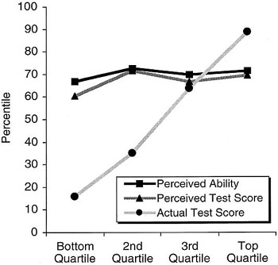

# CTEC3905
<!-- .slide class="smallimg centered" -->

## **Front-End Web Development**
### Lecture 01

---

# STAFF CONTACTS
<!-- .slide class="left-align" -->

**Module leader:**

General queries and admin issues:

**Graeme Stuart**: gstuart@dmu.ac.uk

**Tutors:**
<!-- .slide class="left-align" -->

- Labs: **Graeme Stuart**: gstuart@dmu.ac.uk
- Labs: **Fania Raczinski**: fania.raczinski@dmu.ac.uk
- Lectures: **Dave Everitt**: deveritt@dmu.ac.uk

**Tutor contact outside classes is strictly by email**

## STAFF **KNOWLEDGE**
<!-- .slide class="left-align" -->

- Years of professional and academic **experience**
- We don't know **everything**
- We don't mind if you point out **mistakes**
- Front-end web development is **continuously evolving**
- Tutors are also **always learning**

---

# The **Dunning-Kruger** effect
<!-- .slide class="smalltext smallhead" -->

**BEWARE:** you're probably **better** or **worse** than you think you are:

[The Dunning-Kruger effect on RationalWiki](http://rationalwiki.org/wiki/Dunning-Kruger_effect)

---

# HTML, CSS, JAVASCRIPT
<!-- .slide class="smallimg" -->

- **HTML** defines _**Content**_
- **CSS** specifies _**Appearance**_
- **JavaScript** handles _**Behaviour**_

---

# ASSIGNMENT
<!-- .slide class="left-align" -->
**A website on a topic of your own choice**

No more than **4 separate pages** or **4 distinct screen sections** (for a Single-Page App) that demonstrates your knowledge of **all three front-end languages**.

Most 3rd year students want to create something of use in a **future career**, others choose something that helps **develop a skill** or **interest**.

## **ASSIGNMENT** SUMMARY
<!-- .slide class="left-align" -->
- **Weighting:** 100% of module mark
- **Deadline:** 16:00 Friday 3 April 2020 (week 27)
- **Feedback:** by 16:00 Friday 1 May 2020 (week 31)
- **Submission:** two URLs to the Assessment submission link on Blackboard - *GIT repository URL* and *live GitHub pages URL*

## **ASSIGNMENT** MARKING
<!-- .slide class="left-align" -->
**4 main sections**, each with **5 detailed criteria**

| | |
|---|---|
| **1** | HTML and CSS Code Quality |
| **2** | JavaScript, APIs & JSON |
| **3** | Responsiveness, Accessibility and Interaction |
| **4** | GIT Version Control |

See the marking criteria under **Blackboard -> Assessment**

---

# ATTENDANCE
<!-- .slide class="left-align" -->
`let regularAttendance = "better grade";`

- **attendance** and **active attention** in **labs** *and* **lectures**
- requires **self-motivation** and initiative
- satisfactory **achievement** of **lab exercises**

Specific **learning outcomes** are given for some labs
